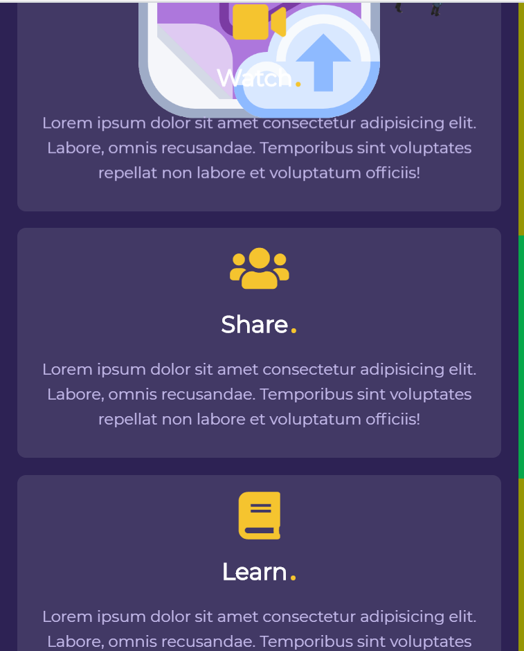

# Parallax Landing Page

Made using HTML5, CSS3 & Javascript with the help of `Rellax.js` library.

`Rellax.js` library helps in varying the speed of different parts of the page while scrolling.

### Screenshot

##### `Desktop`

---

---

##### `Mobile/Tablet`

---

