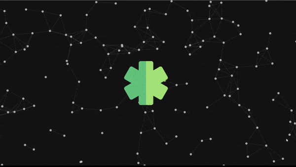

# Particles Effect

Made using HTML5, CSS3 and Vanilla Javascript with the help of `P5.js` library.

`P5.js` library helps in creating a canvas and provide us a platform to show us are artistic side.

<h1> `GIF`</h1>

<h2 align="center">

</h2>
