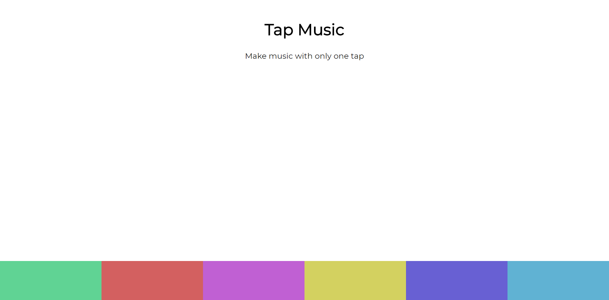
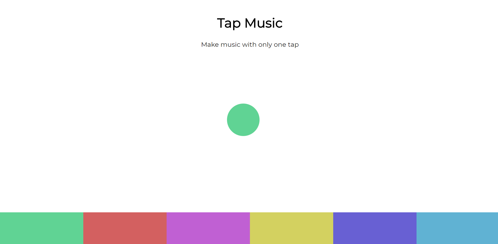
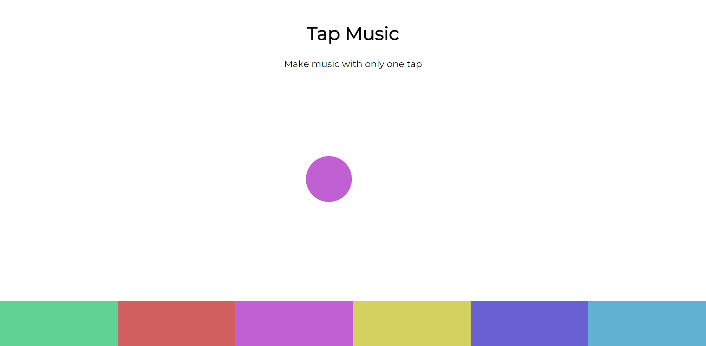
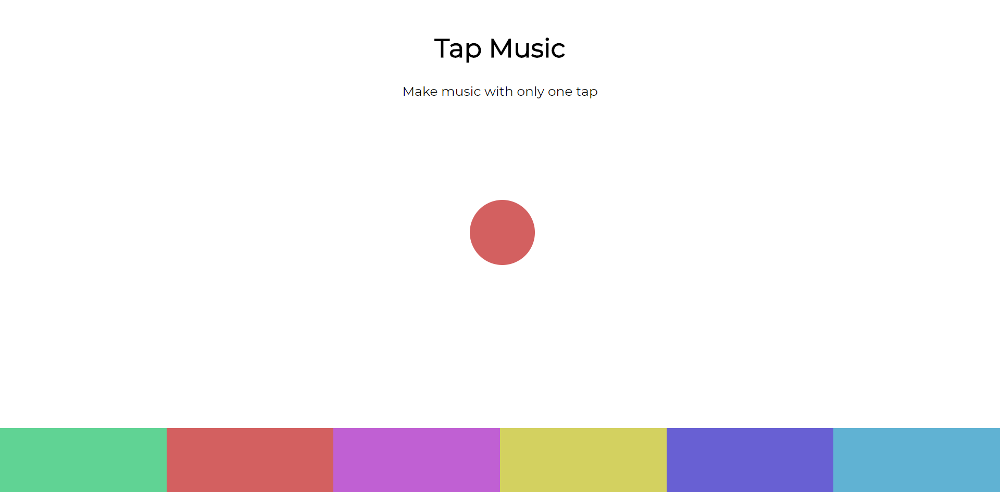
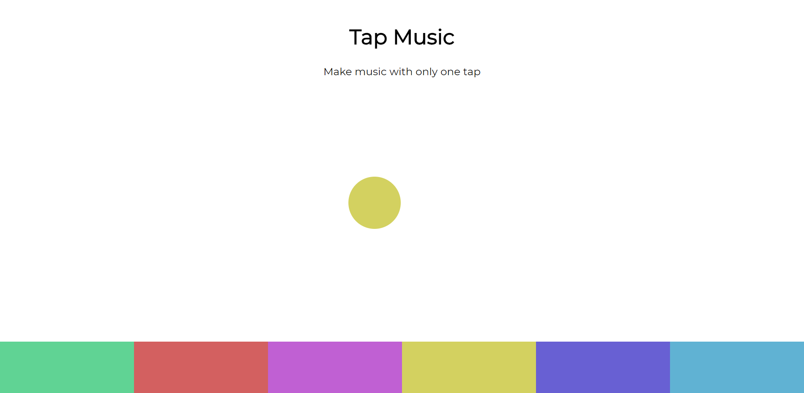
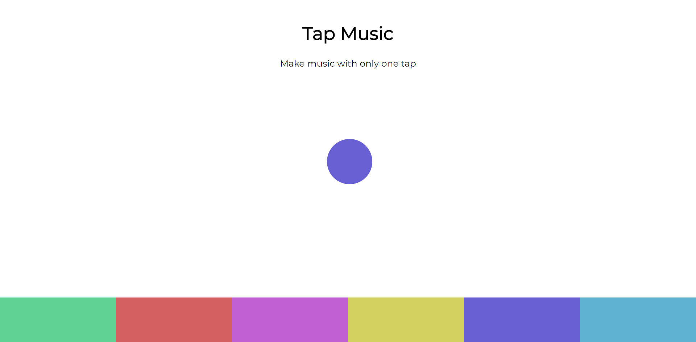
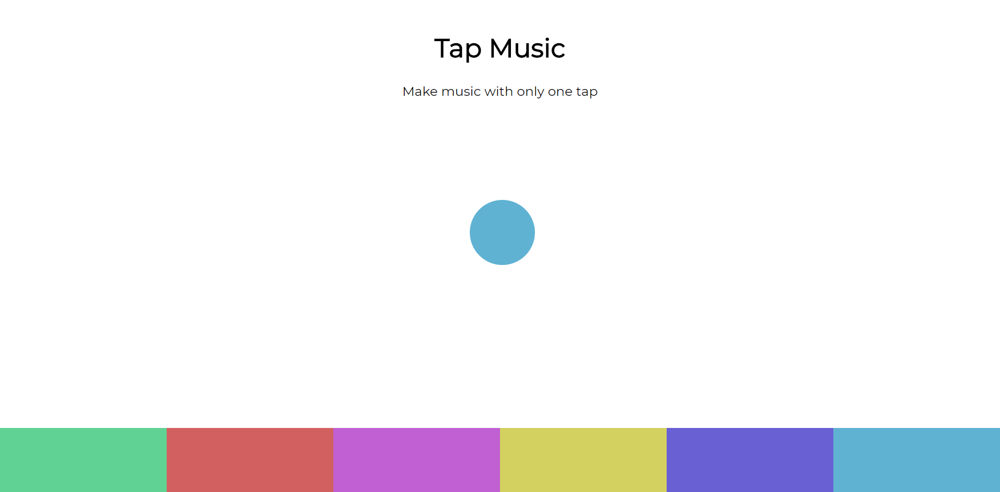

# Sound Effects

##### with visuals

Made using HTML, CSS & Vanilla JavaScript

When clicked on different buttons it makes different sounds with visuals of a ball matching the color of the button you click, going from one end of the screen to the other.

##### Screenshot

---

---

---

---

---

---

