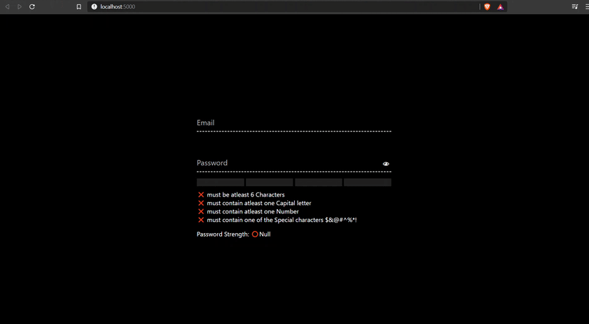

# Login Form with Password Validation Meter

- Made using HTML5, CSS3 & JavaScript(Svelte)

- Simple implementation of validating the password of the user with material design UI interface.

- Made possible from @fireship [Youtube Tutorial](https://www.youtube.com/watch?v=yrrw6KdGuxc&list=PL6BJWfrF6Tl5fiaR6F-jW0KLT2Au3brht&index=6)

### What is [Svelte](https://svelte.dev/)?

Svelte is a radical new approach to building user interfaces. Svelte shifts the work into a compile step that happens when you build your app.

No virtual DOM is present in this Framework with no framework Compiler.

Read More about Svelte [here](https://medium.com/habilelabs/svelte-a-magically-fast-javascript-framework-c854162288dd).

---

## Demo Here👇

